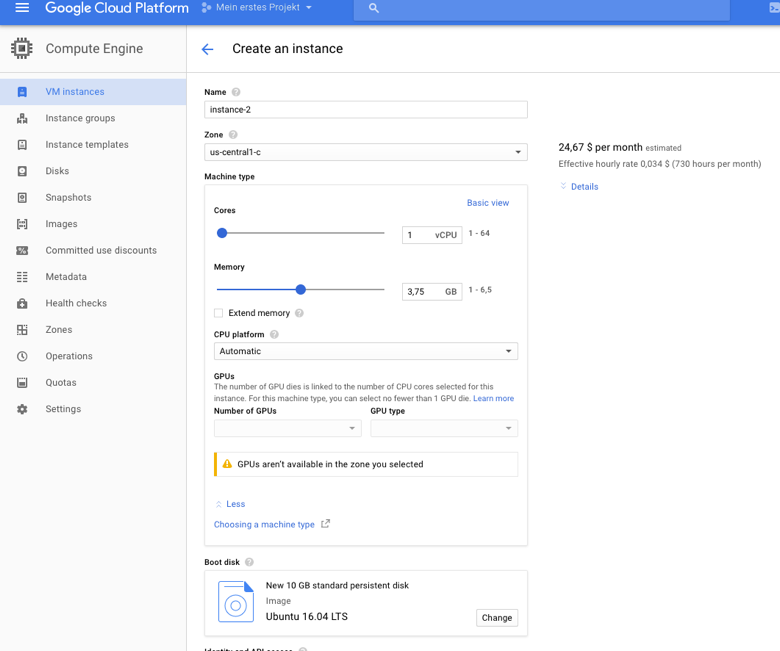

# Google Cloud GPU Instance
Instructions for setting up a GPU instance on Google Cloud

1. Install Google Cloud SDK on your laptop:  
https://cloud.google.com/sdk/
2. Install file by executing the following in the terminal:  

		./google-cloud-sdk/install.sh  
	
3. Initialize gcloud in terminal (https://cloud.google.com/compute/docs/gcloud-compute/?hl=de):  

		gcloud init  

4. Request limit increase for instances  
5. Put in number of GPUs & CPUs, Size:  
https://console.cloud.google.com/compute/quotas?hl=de&_ga=1.69181649.1124953923.1496188820  

6. Create GPU instance:
  

7.  
  

8. GPU are only available in certain areas:  
  

9.  
- Choose Boot disk -> Ubuntu 16.04 LTS  
- Choose 30 GB HDD  
  

10. Select zone, number of GPUs & CPUs and memory  
  

11. Allow HTTP & HTTPS traffic  
  

12. Instance is set up  
  

13. Connect to instance:    

		gcloud compute config-ssh  

  

14. Or:  

		gcloud compute ssh instance-2 --zone us-west1-b
 		ssh –i ~/.ssh/google_compute_engine USERNAME@IP_ADDRESS  

15. Install GPU drivers: 

		curl –O http://developer.download.nvidia.com/compute/cuda/repos/ubuntu1604/x86_64/cuda-repo-ubuntu1604_8.0.61-1_amd64.deb  
		sudo dpkg -i cuda-repo-ubuntu1604_8.0.61-1_amd64.deb  
		sudo apt-get update  
		sudo apt-get install cuda -y  

16. Insert lines in bashrc:  
 
		echo 'export CUDA_HOME=/usr/local/cuda' >> ~/.bashrc  
		echo 'export PATH=$PATH:$CUDA_HOME/bin' >> ~/.bashrc  
		echo 'export LD_LIBRARY_PATH=$LD_LIBRARY_PATH:$CUDA_HOME/lib64' >> ~/.bashrc  
		source ~/.bashrc
 

17. Download cuDNN from Nvidia Developer site -> Sign Up required  
- https://developer.nvidia.com/rdp/cudnn-download  
- Save on laptop: https://developer.nvidia.com/compute/machine-learning/cudnn/secure/v5.1/prod_20161129/8.0/cudnn-8.0-linux-x64-v5.1-tgz  

18. Open terminal on laptop and copy file to instance:  
 
		gcloud compute scp cudnn-8.0-linux-x64-v5.1.tgz *INSTANCE_NAME*:~

19. Go to terminal on instance and extract & install:  
 
		tar -xzvf cudnn-8.0-linux-x64-v5.1.tgz  
		sudo cp cuda/lib64/* /usr/local/cuda/lib64/  
		sudo cp cuda/include/cudnn.h /usr/local/cuda/include/  
		rm -rf ~/cuda  
		rm cudnn-8.0-linux-x64-v5.1.tgz  
		sudo apt-get update   

20. Install python packages:  

		sudo apt-get install python-pip  
		sudo apt-get install python-numpy python-scipy python-matplotlib ipython ipython-notebook  
		sudo apt-get install python-pandas python-sympy 

21. Install Anaconda:  
 
		wget https://repo.continuum.io/archive/Anaconda3-4.4.0-Linux-x86_64.sh  
		bash Anaconda3-4.4.0-Linux-x86_64.sh   

22. Set Anaconda as preferred environment:  
- `which python` should be `usr/bin/python`  
- Important:  

		source .bashrc  
- Generate config file:  

		jupyter notebook --generate-config
		mkdir certs
		sudo openssl req -x509 -nodes -days 365 -newkey rsa:1024 -keyout mycert.pem -out mycert.pem  
		
- Configure jupyter:  

		cd ~/.jupyter/
		vi jupyter_notebook_config.py  
		
- Change username if necessary:  

		c = get_config()
		c.IPKernelApp.pylab = 'inline'  # if you want plotting support always in your notebook
		c.NotebookApp.certfile = u'/home/ubuntu/certs/mycert.pem' #location of your certificate file
		c.NotebookApp.ip = '*'
		c.NotebookApp.open_browser = False  #so that the ipython notebook does not opens up a browser by default
		#c.NotebookApp.password = u'sha1:98ff0e580111:12798c72623a6eecd54b51c006b1050f0ac1a62d'  #the encrypted password we generated above
		c.NotebookApp.port = 8888  
		
		source .bashrc
		
23. Create SSH tunnel:  

		ssh -i ~/.ssh/google_compute_engine -L 8899:localhost:8888 USERNAME@35.197.12.149
		jupyter notebook  
		
		
  

24. Open Browser and type in token:  

		https://localhost:8899/
		
25. Install Keras and Tensorflow:

		pip/conda install keras
		pip/conda install tensorflow-gpu
		conda install opencv
		
26. If GPU process is not running, try to run a keras/tf model first:  

		nvidia-smi  
		
 

### Sources / Appendix

https://medium.com/google-cloud/running-jupyter-notebooks-on-gpu-on-google-cloud-d44f57d22dbd  
https://cloud.google.com/compute/docs/gpus/add-gpus?hl=de#install-driver-manual  
https://cloud.google.com/compute/docs/gcloud-compute/?hl=de  

- One line code to create GPU instance:

		gcloud beta compute instances create gpu-inst1 --machine-type n1-standard-2 --zone us-west1-b --accelerator type=nvidia-tesla-k80, count=1 --image-family ubuntu-1604-lts --image-project ubuntu-os-cloud --boot-disk-size 30GB --maintenance-policy TERMINATE --restart-on-failure

		

		
		

